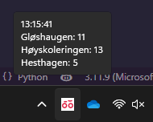

# bikeshare-systray
Show the number of available bikes in your favorite bikeshare stations, directly in the windows systray! Simply update `config.py` with your provider URL, client id and desired stations, and run `main.py`. Your provider must use the [GBFS](https://github.com/MobilityData/gbfs/blob/master/gbfs.md) spec, like [Trondheim bysykkel](https://trondheimbysykkel.no/) and [Oslo bysykkel](https://oslobysykkel.no/) do:-D

## Run on startup
To make the app run on startup, simply run `configure.bat` in the project directory. This will add a launch script to your startup directory and show it to you. If you then want to run it right away without rebooting, just double click `bikeshare-systray-launcher.bat`.

### Uninstall
To undo this, simply delete the launch file from your startup directory: Press `windows key` + `R` and run "shell:startup", then delete the file `bikeshare-systray-launcher.bat`.
